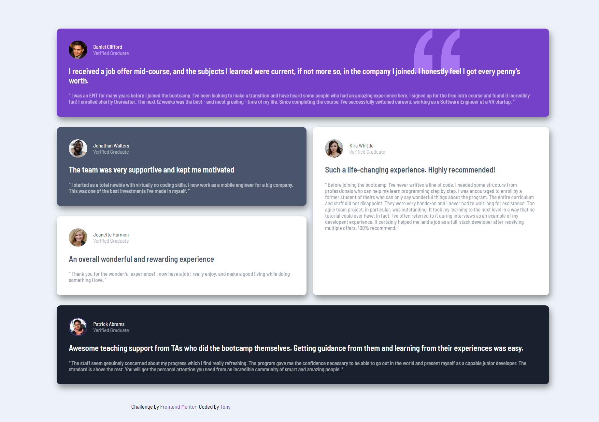

# Frontend Mentor - Testimonials grid section solution
This is a solution to the [Testimonials grid section challenge on Frontend Mentor](https://www.frontendmentor.io/challenges/testimonials-grid-section-Nnw6J7Un7). Frontend Mentor challenges help me improve my coding skills by building realistic projects. 

## Table of contents

- [Overview](#overview)
  - [The challenge](#the-challenge)
  - [Screenshot](#screenshot)
  - [Links](#links)
- [My process](#my-process)
  - [Built with](#built-with)
  - [What I learned](#what-i-learned)
- [Author](#author)

## Overview
### The challenge
Users should be able to:
- View the optimal layout for the site depending on their device's screen size

### Screenshot

### Links
- Solution URL: [Link](https://your-solution-url.com)
- Live Site URL: [Link](https://your-live-site-url.com)

## My process
### Built with
- Semantic HTML5 markup
- CSS custom properties
- Flexbox
- CSS Grid

### What I learned
- Grid-system
- Flex box

# Author
- Frontend Mentor - [@n-tananh](https://www.frontendmentor.io/profile/n-tananh)

